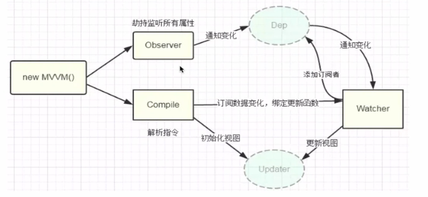

#### 简单的vue2.x原理实现
vue2.x的是典型的MVVM框架，主要使用了Object.defineProperty来进行数据劫持，以及配合发布-订阅者模式达到双向数据绑定的目的。
实现过程主要分为以下模块：
- Observer: 负责数据劫持
- Compile: 负责编译模板
- Watcher: 观察者
- Dep: 依赖收集器

首先，使用Observer对data进行数据劫持，并在get中添加Dep依赖收集器，在初次Compile模板的时候添加Watcher观察者。这样就可以在修改数据的时候触发Watcher的update方法更新视图。
如下所示：
