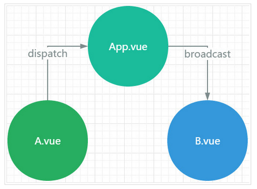

### vuex
##### 一. 什么是vuex
vuex是vue的全局状态管理模式，它采用集中式存储管理所有组件的公众状态，并以相应规则保证状态以一种可预测的方式进行变化

##### 二. 为什么使用vuex
可以试想这样的场景，父组件App中有两个子组件a和b，并且有一个状态被a，b公用。当a修改状态是需要dispatch到父组件，并且父组件broadcast到b。如下图

当同时存在多个子组件时，父组件需要监听多个事件，还需要分发给不同的子组件。十分麻烦。于是vue提出了一个公共状态管理模式来解决这一问题，即vuex。

##### 三. vuex的核心概念
* state: 是vuex的公共状态，可以看做是所有组件的data。
* getters: 是vuex的计算属性，可以看做是所有组件的couputed属性，getters的返回值会根据它的依赖被缓存起来，且只有当它的依赖发生变化时才重新计算
* mutations: 是vuex的方法，可以理解成methods，该函数名官方规定叫type，第一个参数是state，第二个参数是payload，也就是自定义参数。
* actions: 类似于mutations，不同在于：
  * actions提交的是mutations而不是直接变更状态
  * actions中可以包含异步操作，而mutations中不允许
  * actions中的fn的第一个参数是context，是一个与store实例具有相同属性和方法的对象
* modules：由于使用单一状态树，所有状态会集中到一个对象，store会变的臃肿。为了解决这个问题，vuex允许将store分模块。每个模块可以理解成一个子store。

